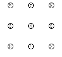
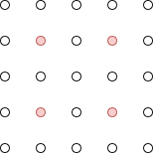
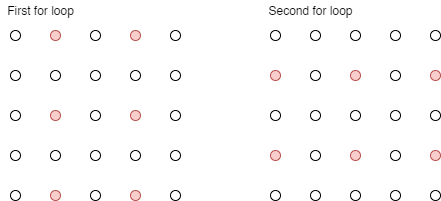
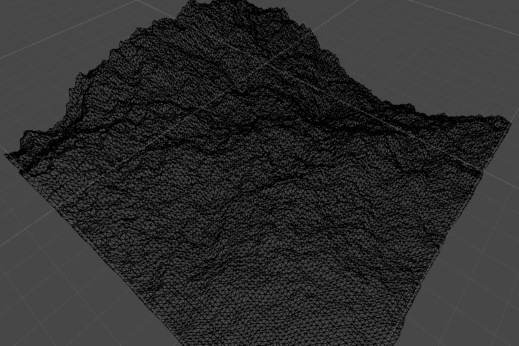
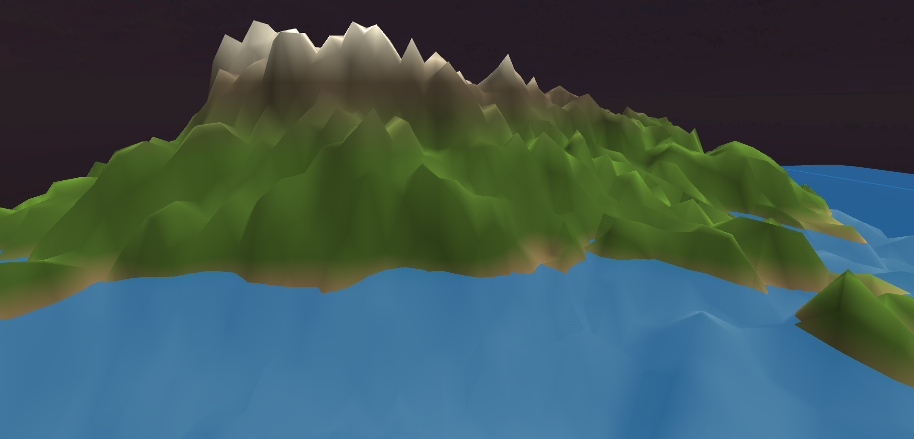
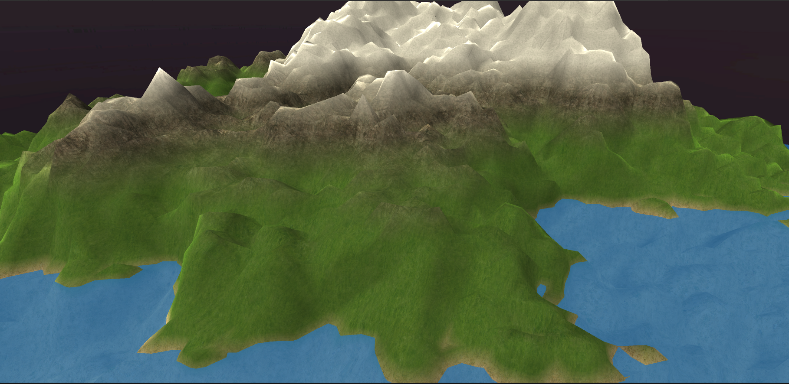
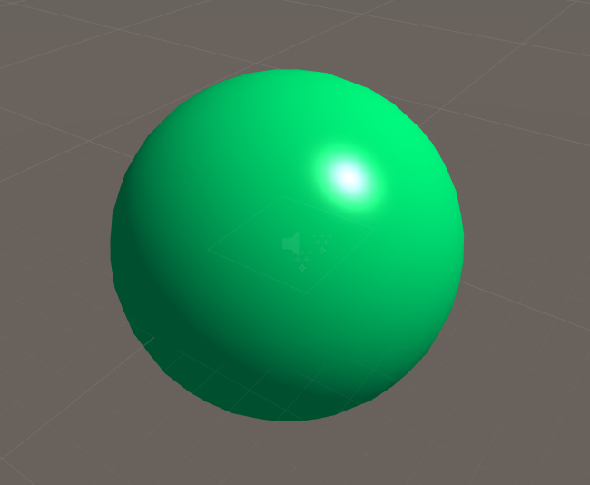

**The University of Melbourne**

# Project-1 README | COMP30019 – Graphics and Interaction

## Table of contents

- [Tasks](#tasks)
- [General Info](#general-info)
- [Branch Syntax](#branch-syntax)
- [Technologies](#technologies)
- [Diamond-Square implementation](#diamond-square-implementation)
- [Camera Motion](#camera-motion)
- [Vertex Shader](#vertex-shader)
- [Surface Shader](#surface-shader)
- [Final Steps](#final-steps)

## Tasks

| Name              |           Task           | State |
| :---------------- | :----------------------: | ----: |
| Kaif Ahsan        |    Phong Illumination    |  Done |
| Kaif Ahsan        | Terrain Colour & Texture |  Done |
| Khant Thurein Han |       Water Shader       |  Done |
| Khant Thurein Han | Diamond Square Algorithm |  Done |
| Hanyong Zhou      | Diamond Square Algorithm |  Done |
| Hanyong Zhou      |      Camera Motion       |  Done |

## General info

Project 1's task is to create a realistic-looking terrain. The features implmented were Terrain generation (Diamond Square), Terrain Shader, Wave Shader, Sun & Light Movement, and Camera Motion & Collision. These features were developed in their respective branches and merged together to create the final product.

## Branch Syntax

- Main branch: master
- Individual features: feature/{branch-name}
- Test Development: develop

## Technologies

Project is created with:

- Unity 2019.4.3f1

## Diamond-Square implementation

Before the implementation of the algorithm, a flat square grid consisting of vertices is generated with sides of length 2^n+1 vertices. In our case, we decided that a n=7 value generated the most suitable terrain. Our diamond square algorithm will go on to alter the height of these vertices in the grid. These vertices are stored in a 1D array and the 2D position of the vertices will be calculated throughout the algorithm to improve efficiency. The numbers shown below in the diagram represent the indices of each vertex in a 1D array but represented as a 3x3 grid.

<p align="center">
  
</p>

The Diamond-Square algorithm was implemented using recursion. Each iteration of the recursion consisted of one or more square and diamond steps. It is worth noting that on a diamond/square step, the width and heights of the corner points were always relative to the current iteration of the algorithm.

<p align="center">
  
</p>

As seen above, if we started with a 4x4 grid, the first iteration would start with a diamond step that used the initial corner points, forming a square with dimension 4. On the second iteration, there would then be multiple diamond steps each with corner points that formed a square with dimension 2. As we can see, each iteration would half the dimension. Using this property, we half the dimension in each recursive step until we reach the base case of dimension = 1.

### Recursive Diamond Square Algorithm

```c#
void RecursiveDSquare (int dim, float heightDiff) {
        // base case of lowest granularity step
        if (dim == 1) {
            return;
        }

        // perform diamond step on respective vertices
        for (int z = 0; z < size - 1; z += dim) {
            for (int x = 0; x < size - 1; x += dim) {
                int centre = (int) ((z * size + x) + (dim * 0.5 * size + dim * 0.5));
                DiamondStep (centre, dim, heightDiff);
            }
        }
        .
        . // square steps
        .
```

The `DiamondStep` function takes in the index of our `centre` vertice, and using the current dimension `dim` (which is recursively reduced as previously mentioned), calculates the index of the four corners. This is then used to find the average of the four corners plus a random proportion of `heightDiff` to be set as the new centre vertice height. As we can see in our `RecursiveDSquare` function, we perform the diamond step across every `dim` vertices in both the x and z axis. For example, on the second iteration of a 4x4 grid, the following red vertices would have the DiamondStep function called upon them. This is due to `dim` having a value of 2, hence in every 2 rows, we alter every 2 columns.

<p align="center">
  
</p>

Following this, we go on to perform square steps. The `SquareStep` function is very similar to the `DiamondStep` function, except that the corners used are in the shape of a diamond instead. In addition, if the SquareStep is performed on a vertice that sits on the edge of the grid, the average of the available 3 corner points is used instead.

```c#
        // perform square step on alternating rows
        for (int z = (int) (dim * 0.5); z < size; z += dim) {
            for (int x = 0; x < size; x += dim) {
                SquareStep (z * size + x, dim, heightDiff);
            }
        }

        // perform square step on other alternating rows
        for (int z = 0; z < size; z += dim) {
            for (int x = (int) (dim * 0.5); x < size; x += dim) {
                SquareStep (z * size + x, dim, heightDiff);
            }
        }
        .
        .
        .
```

From above, we perform the square steps every alternating `dim` rows, as better explained in the following diagram:

<p align="center">
  
</p>

In essence, both "for" loops iterate through the same pattern of vertices, just at different starting points. This is easier to implement as the vertices being altered all occur on the same column as shown in the diagram.

```c#
        // reduce random height being added
        float newHeightDiff = (float) (heightDiff * heightDepreciation);

        RecursiveDSquare ((int) (dim * 0.5), newHeightDiff);
    }
```

Finally, we multiply the `heightDiff` by a constant betwen 0-1, resulting in a smaller and smaller random height being added to the vertices on each iteration as per the typical Diamond Square Algorithm steps. We can also see how we are halving the `dim` value being used for the next iteration.

### Vertices to Triangles

```c#
        triangles = new int[(size - 1) * (size - 1) * 6];
        for (int z = 0; z < size - 1; z++) {
            for (int x = 0; x < size - 1; x++) {
                triangles[(z * (size - 1) + x) * 6] = z * size + x;
                triangles[(z * (size - 1) + x) * 6 + 1] = z * size + x + size;
                triangles[(z * (size - 1) + x) * 6 + 2] = z * size + x + 1;
                triangles[(z * (size - 1) + x) * 6 + 3] = z * size + x + 1;
                triangles[(z * (size - 1) + x) * 6 + 4] = z * size + x + size;
                triangles[(z * (size - 1) + x) * 6 + 5] = z * size + x + size + 1;
            }
        }
```

After altering the height of our vertices, the code above was used to define the vertices of each triangle which will represent our terrain. It calculates the index of appropriate vertices of each triangle in a clockwise direction to allow proper rendering. After this, we assign the vertice and triangle arrays to `mesh` and call `mesh.RecalculateNormals()`. This lets Unity handle the new normal calculations of each vertex so that shading is applied appropriately according to the incoming sunlight direction.

### Result

<p align="center">
  
</p>

As seen, Unity represents the terrain as a mesh consisting of triangles. The terrain is being regenerated on each press of the `space` key.

## Camera Motion

The movement of the camera is controlled by the typical `WASD` keys.

```c#
  float x = Input.GetAxis("Horizontal");
  float z = Input.GetAxis("Vertical");
  Vector3 move = cam.transform.right*x+cam.transform.forward*z;
  controller.Move(move*speed*Time.deltaTime);
```

As we can see in the code above, we are utilising `cam.transform.right` and `cam.transform.forward` so that the movements of left, right, forward and backwards are local to the direction the camera is facing. Furthermore, movement is also relative to the time passed since the last frame, ensuring that the amount of movement being seen by our player is consistent throughout use.

```c#
  xRotation += Input.GetAxis("Mouse X") * rotateSpeed;
  zRotation += Input.GetAxis("Mouse Y") * rotateSpeed;
  cam.transform.rotation = Quaternion.Euler(-zRotation, xRotation, 0);
```

Similary, the rotation of our camera is handled by the current axis of the mouse. Hence any mouse movements will be used and added to the camera's rotation. This added rotation is represented by `Quaternion.Euler()` in which we rotate the camera around the local z-axis depending on our mouse's Y-axis movement, and a rotation around the local x-axis depending on our mouse's X-axis movement.

### Camera collision

Camera collision is handled using Unity's discrete collision in order to prevent collision into the terrain. Furthermore, by altering the workshop's cubescript, an invisible prism is set to surround the terrain, such that it can be provided a collision mesh and prevent the camera from exiting the boundaries.

## Terrain Texture

To provide a realistic took to the terrains different colours were initially added to the terrain based on the height of the terrain. However, to give a realistic look, terrain textures were used. Using a standard surface shader, these textures were blended to attain a natural look whilst providing us control on the look and feel of the terrain.

|          Without Texture             |          With Texture          |
| :----------------------------------- | :----------------------------: |
|  |  |

## Vertex Shaders

### Phong Illumination

Both the terrain and water uses the Phong illumination model for its custom shaders. The Phong illumination is made of 3 components: Ambient, Diffuse, and Specular. The specular component has been omitted for the terrain as a realistic terrain does not look shiny. The attenuation factor is set to a constant of 1 as the light source used in the project is a directional light.

<p align="center">
  
</p>

## Wave generation

The wave uses a custom shader that uses the Phong illumination model. The wave motion is created by the shader, by adding a displacement value to the height of a flat plane with respect to its x, z, and Time values. Using a sin function, this creates a a wave motion resembling a sin wave. Rather than using the built-in Plane 3D object in Unity, a custom Plane object was created so that it would contain more vertices/triagles for the wave motion to look smoother.

<p align="center">
  
</p>

## Sun Implementation

The sun rotation is implemented by a simple Z rotation script. By nesting the sphere and directional light in an empty game object, the sphere was set to a specfic distance relative to the parent game object. Rotating the parent object would thus rotate the sun and the direction of the light around the terrain.

<p align="center">
  
</p>

## Final Steps

Once the individual features were implemented in their respective branches, we merged the features into the develop branch and began to piece together the features to create our final product. The terrain was generated by adding the GenerateTerrain.cs script onto an empty game object with the required components initialized, using a material which that implements the custom Phong shader. The rotating sun was created by nesting directional light inside a game object to simulate the sun rising/setting. The water by generating a flat plane and adding a material which implements the water shader. The camera motion utilised the FreeCam.cs script, which was added onto Main Camera. An empty game object is then also created to box the terrain in a collider which prevents the main camera from moving outside the terrain. A custom skybox was also added for extra effect. The last step was to tweak the values of these features to make it look as realistic as possible.
