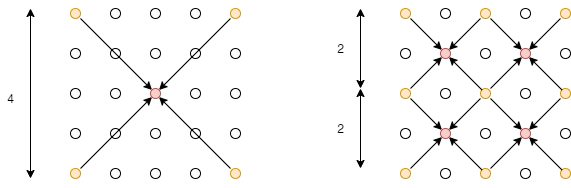
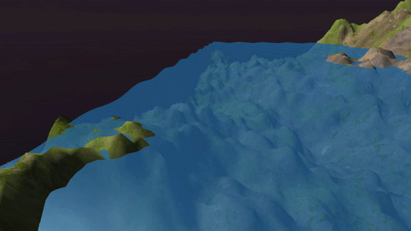
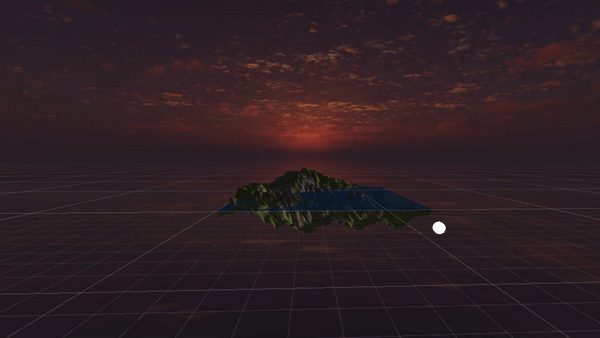

**The University of Melbourne**

# Project-1 README | COMP30019 – Graphics and Interaction 

## Table of contents

- [Team Members](#team-members)
- [General Info](#general-info)
- [Branch Syntax](#branch-syntax)
- [Technologies](#technologies)
- [Diamond-Square implementation](#diamond-square-implementation)
- [Camera Motion](#camera-motion)
- [Vertex Shader](#vertex-shader)
- [Final Steps](#final-steps)

## Team Members

| Name           |        Task        |       State |
| :------------- | :----------------: | ----------: |
| Kaif Ahsan     | Phong Illumination |        Done |
| Kaif Ahsan     |  Terrain Texture   | In Progress |
| Khant Thurein Han |   Water Shader  |     Done |
| Khant Thurein Han |   Diamond Square Algorithm    |     Done |
| Hanyong Zhou |   Diamond Square Algorithm    |    Done |
| Hanyong Zhou |   Camera Motion   |    Done |


## General info

Project 1's task is to create a realistic-looking terrain. The features implmented were Terrain generation (Diamond Square), Terrain Shader, Wave Shader, Sun & Light Movement, and Camera Motion & Collision. These features were developed in their respective branches and merged together to create the final product.
## Branch Syntax
- Main branch: master
- Individual features: feature/{branch-name}
- Test Development: develop


## Technologies

Project is created with:

- Unity 2019.4.3f1

## Diamond-Square implementation

Before the implementation of the algorithm, a flat square grid consisting of vertices is generated with sides consisting of 2^n+1 vertices. In our case, we decided that an n=7 value generated the most suitable terrain.

The Diamond-Square algorithm was then implemented using recursion. Each iteration of the recursion consisted of one or more square and diamond steps. It is worth noting that on a diamond/square step, the width and heights of the corner points were always relative to the current iteration of the algorithm. 

<p align="center">
  
</p>

As seen above, if we started with a 4x4 grid, the first iteration would start with a diamond step that used the initial corner points, forming a square with dimension 4. On the second iteration, there would then be multiple diamond steps each with corner points that formed a square with dimension 2. As we can see, each iteration would half the dimension. Using this property, we half the dimension in each recursive step until we reach the base case of dimension = 1.


```c#
void RecursiveDSquare (int dim, float heightDiff) {
        // base case of lowest granularity step
        if (dim == 1) {
            return;
        }

        // perform diamond step on respective vertices
        for (int z = 0; z < size - 1; z += dim) {
            for (int x = 0; x < size - 1; x += dim) {
                int centre = (int) ((z * size + x) + (dim * 0.5 * size + dim * 0.5));
                DiamondStep (centre, dim, heightDiff);
            }
        }
        .
        . // square steps
        .
    }
```

## Camera Motion

You can use images/gif by adding them to a folder in your repo:

<p align="center">
  
</p>

To create a gif from a video you can follow this [link](https://ezgif.com/video-to-gif/ezgif-6-55f4b3b086d4.mov).


## Vertex Shaders

### Phong Illumination

Both the terrain and water uses the Phong illumination model for its custom shaders. The Phong illumination is made of 3 components: Ambient, Diffuse, and Specular. The specular component has been omitted for the terrain as a realistic terrain does not look shiny. The attenuation factor is set to a constant of 1 as the light source used in the project is a directional light.

## Wave generation

The wave uses a custom shader that uses the Phong illumination model. The wave motion is created by the shader, by adding a displacement value to the height of a flat plane with respect to its x, z, and Time values. Using a sin function, this creates a a wave motion resembling a sin wave. Rather than using the built-in Plane 3D object in Unity, a custom Plane object was created so that it would contain more vertices/triagles for the wave motion to look smoother.

<p align="center">
  
</p>

## Sun Implementation

The sun rotation is implemented by a simple Z rotation script. By nesting the sphere and directional light in an empty game object, the sphere was set to a specfic distance relative to the parent game object. Rotating the parent object would thus rotate the sun and the direction of the light around the terrain.

<p align="center">
  
</p>

## Final Steps
Once the individual features were implemented in their respective branches, we merged the features into the develop branch and began to piece together the features to create our final product. The terrain was generated by adding the GenerateTerrain.cs script onto an empty game object with the required components initialized, using a material which that implements the custom Phong shader. The rotating sun was created by nesting directional light inside a game object to simulate the sun rising/setting. The water by generating a flat plane and adding a material which implements the water shader. The camera motion utilised the FreeCam.cs script, which was added onto Main Camera. An empty game object is then also created to box the terrain in a collider which prevents the main camera from moving outside the terrain. A custom skybox was also added for extra effect. The last step was to tweak the values of these features to make it look as realistic as possible.