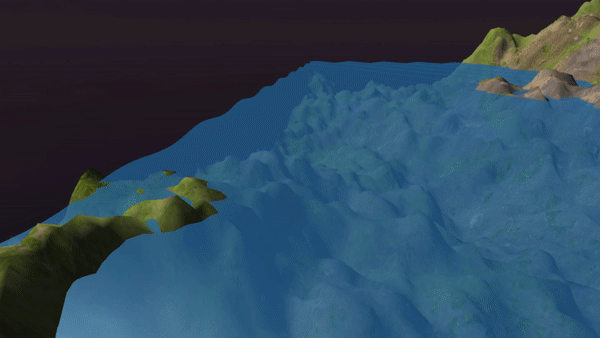
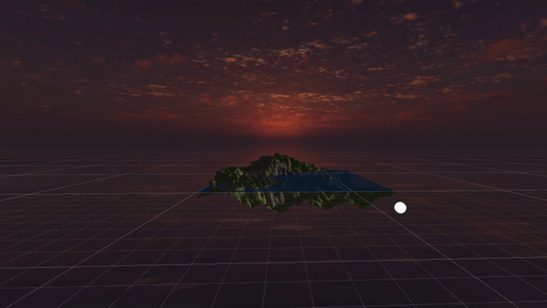

**The University of Melbourne**

# COMP30019 – Graphics and Interaction

# Project-1 README

Remember that _"this document"_ should be `well written` and formatted **appropriately**. It should be easily readable within Github. Modify this file...
this is just an example of different formating tools available for you. For help with the format you can find a guide [here](https://docs.github.com/en/github/writing-on-github).

## Table of contents

- [Team Members](#team-members)
- [General Info](#general-info)
- [Technologies](#technologies)
- [Diamond-Square implementation](#diamond-square-implementation)
- [Camera Motion](#camera-motion)
- [Vertex Shader](#vertex-shader)

## Team Members

| Name           |        Task        |       State |
| :------------- | :----------------: | ----------: |
| Kaif Ahsan     | Phong Illumination |        Done |
| Kaif Ahsan     |  Terrain Texture   | In Progress |
| Khant Thurein Han |   Water Shader (Phong)    |     Done |
| Khant Thurein Han |   Diamond Square Algorithm    |     Done |
| Hanyong Zhou |   Diamond Square Algorithm    |    Done |
| Hanyong Zhou |   Camera Motion   |    Done |


## General info

This is project - 1 ...
Lorem ipsum dolor sit amet, consectetur adipiscing elit, sed do eiusmod tempor incididunt ut labore et dolore magna aliqua. Ut enim ad minim veniam, quis nostrud exercitation ullamco laboris nisi ut aliquip ex ea commodo consequat. Duis aute irure dolor in reprehenderit in voluptate velit esse cillum dolore eu fugiat nulla pariatur. Excepteur sint occaecat cupidatat non proident, sunt in culpa qui officia deserunt mollit anim id est laborum

## Technologies

Project is created with:

- Unity 2019.4.3f1
- Ipsum version: 2.33
- Ament library version: 999

## Diamond-Square implementation

Before the implementation of the algorithm, a flat square grid consisting of vertices is generated with sides consisting of 2^n+1 vertices. In our case, we decided that an n=8 value generated the most suitable terrain.

The Diamond-Square algorithm was then implemented using recursion. Each iteration of the recursion consisted of one or more square and diamond steps. It is worth noting that on a diamond/square step, the width and heights of the corner points were always relative to the current iteration of the algorithm. 

<p align="center">
  
</p>

As seen above, if we started with a 4x4 grid, the first iteration would start with a diamond step that used the initial corner points, forming a square with dimension 4. On the second iteration, there would then be multiple diamond steps each with corner points that formed a square with dimension 2. As we can see, each iteration would half the dimension. Using this property, we half the dimension in each recursive step until we reach the base case of dimension = 1.


```c#
void RecursiveDSquare (int dim, float heightDiff) {
        // base case of lowest granularity step
        if (dim == 1) {
            return;
        }

        // perform diamond step on respective vertices
        for (int z = 0; z < size - 1; z += dim) {
            for (int x = 0; x < size - 1; x += dim) {
                int centre = (int) ((z * size + x) + (dim * 0.5 * size + dim * 0.5));
                DiamondStep (centre, dim, heightDiff);
            }
        }

        .
        .
        .
        
    }
```

## Camera Motion

You can use images/gif by adding them to a folder in your repo:

<p align="center">
  
</p>

To create a gif from a video you can follow this [link](https://ezgif.com/video-to-gif/ezgif-6-55f4b3b086d4.mov).

## Wave generation

The wave uses a custom shader that uses the Phong illumination model. The wave motion is created by the shader, by adding a displacement value to the height of a flat plane with respect to its x, z, and Time values. 

<p align="center">
  
</p>

## Vertex Shaders

### Phong Illumination

## Sun Implementation

The sun rotation is implemented by a simple Z rotation script. By nesting the sphere and directional light in an empty game object, the sphere was set to a specfic distance relative to the parent game object. Rotating the parent object would thus rotate the sun and the direction of the light around the terrain.

<p align="center">
  
</p>

**Now Get ready to complete all the tasks:**

- [x] Read the handout for Project-1 carefully
- [x] Modelling of fractal landscape
- [x] Camera motion
- [ ] Surface properties
- [ ] Project organisation and documentation
